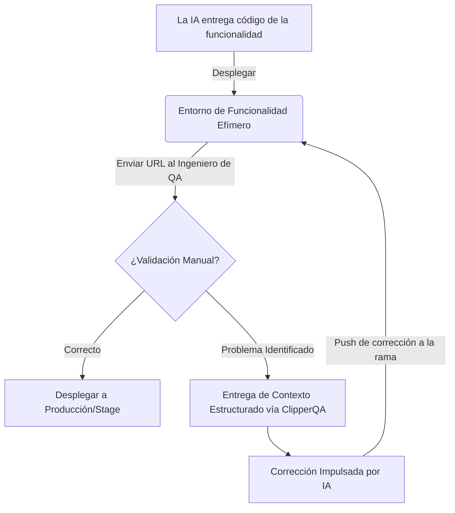

Traducción: [Leer en Ruso (🇷🇺)](https://www.google.com/search?q=./README.ru.md) | [Read in English (🇺🇸)](https://www.google.com/search?q=./README.md)

# ClipperQA: Orquestador de QA con Contexto Inteligente

**ClipperQA** es un motor de diagnóstico de alta precisión para ecosistemas basados en React. Cierra la brecha entre el aseguramiento de calidad manual y la corrección impulsada por IA, capturando telemetría técnica completa en el momento en que se descubre un error.

### Capacidades Principales:

- **Trazabilidad Granular:** Vincula automáticamente los elementos de la interfaz de usuario con las rutas de los archivos de origen mediante atributos `data-qa-file`.
- **Captura de Contexto Determinista:** Extrae el estado exacto de las _props_ de React Fiber y las clases de Tailwind CSS.
- **Agrupación Contextual (Batching):** Agrega informes de errores en LocalStorage para un envío unificado, garantizando la persistencia de los datos.
- **Conciencia Adaptativa (Responsive):** Registra el punto de interrupción activo (Móvil/Escritorio) para asegurar que las correcciones de la IA se apliquen correctamente.

---

## ¿Por qué ClipperQA? (Nativo para IA vs. Centrado en Humanos)

Las soluciones de feedback actuales (ej. Marker.io, rrweb) están diseñadas para la comunicación **entre humanos**. Se centran en grabaciones de video y registros de consola, lo que genera "ruido de información" para los modelos de lenguaje (LLM).

- **Densidad de Información:** ClipperQA entrega **JSON estructurado**, permitiendo que la IA identifique la línea exacta de código.
- **Optimización de Tokens:** Al filtrar datos irrelevantes, ClipperQA reduce el tamaño de los _prompts_ entre un **60% y 80%** en comparación con volcados de HTML puro.
- **Velocidad de Ciclo:** El mapeo directo de rutas de archivos permite que la IA realice correcciones en un solo paso, evitando múltiples iteraciones de "¿dónde está este componente?".

---

## Ciclo de Vida Operativo (Human-in-the-Loop)

ClipperQA empodera al ingeniero de QA para actuar como la "Fuente de Verdad" mientras la IA actúa como el "Motor de Corrección".



### Flujo de Trabajo Detallado:

1.  **Agrupación (Batching):** El tester navega por el sitio, haciendo clic en los componentes (ej. Alt+Clic) para recolectar de 5 a 10 errores en la "cesta" del widget.
2.  **Entrega:** Al hacer clic en "Enviar", el widget genera un único _Issue_ en GitLab con la carga útil JSON y limpia el LocalStorage.
3.  **Activador de IA:** Un Webhook de GitLab activa al agente de IA para corregir todos los problemas reportados en un solo pase.
4.  **Redespliegue:** El CI de GitLab actualiza el entorno de la funcionalidad para la verificación final.

---

## Integración Técnica

### 1\. Requisitos Previos

| Paquete                      | Propósito                                                   |
| :--------------------------- | :---------------------------------------------------------- |
| **`react`**, **`react-dom`** | UI principal para el widget `ClipperQA.tsx`.                |
| **`lucide-react`**           | Iconos de la interfaz para el panel.                        |
| **`@babel/core`**            | Requerido para la instrumentación en tiempo de compilación. |

### 2\. Opciones de Implementación

#### Opción A: Instrumentación Automática (Babel)

El plugin añade atributos `data-qa-*` y puede auto-inyectar el widget `<ClipperQA />` en los archivos de entrada como `src/App.tsx` o `layout.tsx`.

**Next.js (`.babelrc`):**

```json
{
  "presets": ["next/babel"],
  "plugins": ["./plugins/clipper-qa/index.js"]
}
```

**Vite (`vite.config.ts`):**

```typescript
import path from 'node:path'
import { defineConfig } from 'vite'
import react from '@vitejs/plugin-react'

export default defineConfig({
  plugins: [
    react({
      babel: {
        plugins: [path.resolve(__dirname, 'plugins/clipper-qa/index.js')],
      },
    }),
  ],
})
```

#### Opción B: Montaje Manual del Widget

Si prefiere no usar el plugin de Babel para la inyección, impórtelo manualmente en su componente raíz:

```tsx
import { ClipperQA } from '../plugins/clipper-qa/ClipperQA'

// Renderice esto en la raíz de su aplicación
;<body>
  {children}
  <ClipperQA />
</body>
```

---

## Seguridad y Cumplimiento

- **Sin Fuga de PII:** A diferencia de los grabadores de video, ClipperQA solo captura metadatos estructurales y _props_ específicas.
- **Listo para Auditoría:** Cada informe de error está vinculado a un _commit_ de git y una ruta de archivo específicos, creando un rastro de auditoría transparente para el cumplimiento normativo.

---

**Diseñado para la precisión. Optimizado para la IA. Construido para el SDLC moderno.**
