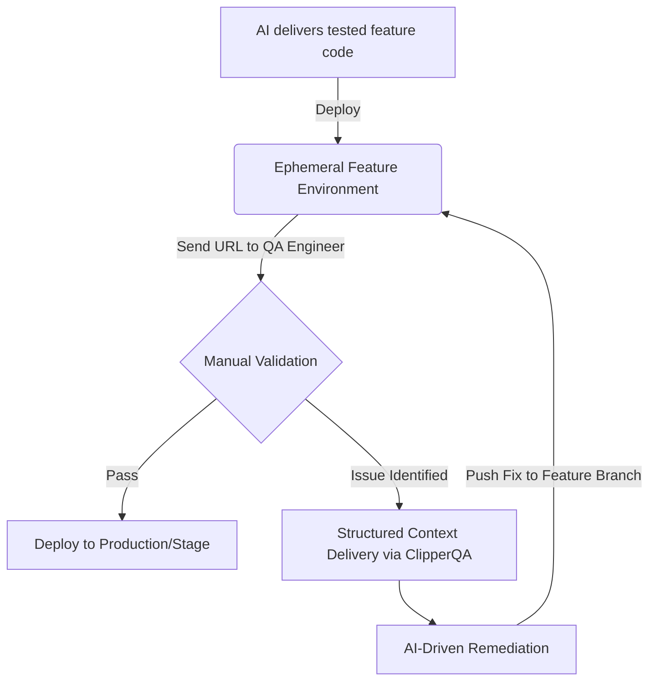

    

Translation: [Читать на русском языке (🇷🇺)](./README.ru.md) | [Leer en español (es)](./README.es.md)

# ClipperQA: Context-Aware QA Orchestrator

**ClipperQA** is a high-precision diagnostic engine for React-based ecosystems. It bridges the gap between manual quality assurance and AI-driven remediation by capturing full technical telemetry at the moment of bug discovery.

### Core Capabilities:

- **Granular Traceability:** Automatically maps UI elements to source-level file paths using `data-qa-file`.
- **Deterministic Context Capture:** Extracts the exact state of React Fiber props and Tailwind CSS classes.
- **Contextual Batching:** Aggregates bug reports in LocalStorage for unified submission, ensuring data persistence.
- **Responsive Awareness:** Logs the active breakpoint (Mobile/Desktop) to ensure UI fixes are applied correctly.

---

## Why ClipperQA? (AI-Native vs. Human-Centric)

Current feedback solutions (e.g., Marker.io, rrweb) are designed for **human-to-human** communication. They focus on video recordings and console logs, which create "information noise" for LLMs.

- **Information Density:** ClipperQA delivers **structured JSON**, allowing AI to pinpoint the exact line of code.
- **Token Optimization:** By filtering out irrelevant data, ClipperQA reduces prompt sizes by up to **60–80%** compared to raw HTML dumps.
- **Cycle Velocity:** Direct file-path mapping enables AI to perform one-pass remediation, avoiding multiple "where is this component?" iterations.

---

## Operational Lifecycle (Human-in-the-Loop)

ClipperQA empowers the QA Engineer to act as the "Ground Truth" provider while the AI acts as the "Remediation Engine".



### Detailed Workflow:

1.  **Batching:** The tester navigates the site, clicking components (e.g., Alt+Click) to collect 5-10 bugs into the widget's "basket".
2.  **Delivery:** Upon clicking "Send," the widget generates a single GitLab Issue with the JSON payload and clears LocalStorage.
3.  **AI Trigger:** A GitLab Webhook activates the AI agent to fix all reported issues in a single pass.
4.  **Re-deploy:** GitLab CI updates the feature environment for final verification.


---

## Technical Integration

### 1. Prerequisites

| Package                      | Purpose                                  |
| ---------------------------- | ---------------------------------------- |
| **`react`**, **`react-dom`** | Core UI for the `ClipperQA.tsx` widget.  |
| **`lucide-react`**           | UI Icons for the panel.                  |
| **`@babel/core`**            | Required for build-time instrumentation. |

### 2. Implementation Options

#### Option A: Automatic Instrumentation (Babel)

The plugin adds `data-qa-*` attributes and can auto-inject the `<ClipperQA />` widget into entry files like `src/App.tsx` or `layout.tsx`.

**Next.js (`.babelrc`):**

```json
{
  "presets": ["next/babel"],
  "plugins": ["./plugins/clipper-qa/index.js"]
}
```

**Vite (`vite.config.ts`):**

```typescript
import path from 'node:path'
import { defineConfig } from 'vite'
import react from '@vitejs/plugin-react'

export default defineConfig({
  plugins: [
    react({
      babel: {
        plugins: [path.resolve(__dirname, 'plugins/clipper-qa/index.js')],
      },
    }),
  ],
})
```

#### Option B: Manual Widget Mounting

If you prefer not to use the Babel plugin for widget injection, import it manually into your root component:

```tsx
import { ClipperQA } from '../plugins/clipper-qa/ClipperQA'

// Render this at the root of your application
;<body>
  {children}
  <ClipperQA />
</body>
```

---

## Safety & Compliance

- **No PII Leakage:** Unlike video recorders, ClipperQA only captures structural metadata and specific props.
- **Audit Ready:** Every bug report is linked to a specific git commit and file path, creating a transparent audit trail for compliance.

---

**Designed for precision. Optimized for AI. Built for the modern SDLC.**
