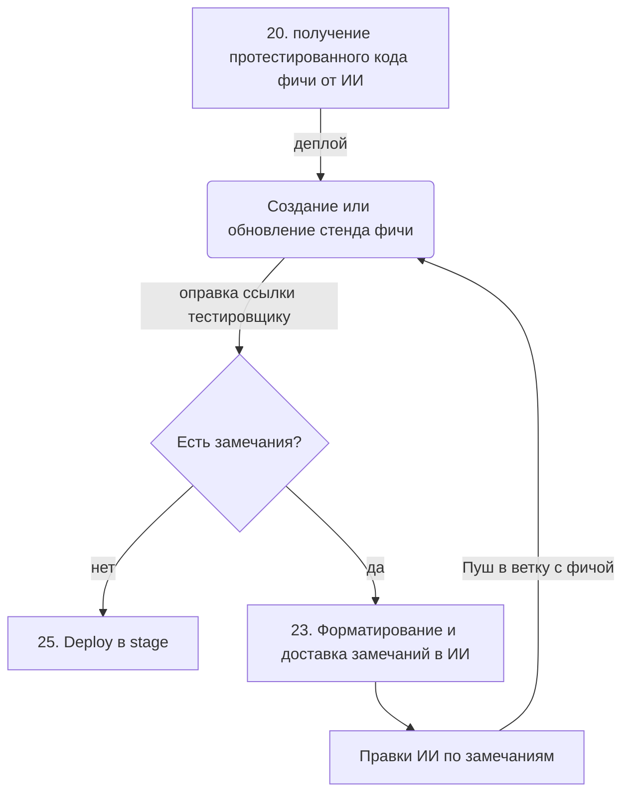

# ClipperQA

Интеллектуальный "клипер" для React-приложений, который позволяет тестировщикам собирать серию багов с полным техническим контекстом для ИИ-разработки.

### Основные возможности:
- **Component Inspection:** Автоматическое определение пути к файлу (`data-qa-file`).
- **Context Capture:** Захват пропсов из React Fiber и Tailwind-классов.
- **Batching:** Сбор серии багов в LocalStorage для единой отправки в Replit/GitLab.
- **Responsive Aware:** Фиксация активного брейкпоинта (Mobile/Desktop).


Ручное тестирование  с отправкой данных в ИИ

## Место в общей схеме



https://mermaid.ai/d/bf641ee5-c02c-4acd-966e-fea178f1242f

### Окружение

- создание отдельной ветки для ручного тестирования фичи
- создание отдельного стенда для этой ветки (dev mode)
- отправка ссылки тестировщику

## Задача

Нужен иструмент для ручного сбора и описания багов

### Условия

- удобный и понятный для тестировщика
- структурированное описание багов для ИИ
- экономия (токенов и времени сборки)

### Поиск

Все готовые инструменты обратной связи ориентированы на человека, а не на ИИ. Одни направлены либо на упрощении интеграции с gitlab issue (Marker.io), другие - на сбор дополнительной инфы: скриншоты/видео, логи консоли и сетевые запросы, данные об окружении (rrweb).

Для ИИ это означает отсутствие структуры, информационный шум (потеря фокуса) и лишнюю трату токенов.

Самый экономичный вариант - написать маленький кастомный скрипт.

### Клиппер

Скрипт интегрируется на этапе сборки.
Работает по принципу «Инспектора компонентов».

data-атрибуты - при сборке фронтенда в каждый компонент добавляется его название и путь к файлу.

Пример в коде:

```
<div
    data-qa-component="Header"
    data-qa-file="src/components/Header.tsx"
>...</div>
```

Когда тестировщик кликает на баг (например с Alt), скрипт поднимается вверх по дереву до ближайшего элемента с нужным data-атрибутом.

Клиппер собирает структурированно инфо для ИИ. Пример одного объекта из серии:

```JSON
{
  "page_url": "/dashboard/settings",
  "component_name": "SettingsForm",
  "file_path": "src/features/settings/ui/SettingsForm.tsx",
  "element_selector": "form > .submit-btn",
  "user_report": "Кнопка 'Сохранить' выходит за границы контейнера на мобильных устройствах",
}
```

В структуру можно добавить тип экрана (декстоп/мобилка, размеры экрана), список классов проблемного элемента и текущие props компонента (из \_\_reactProps$ с фильтрацией).

### Сбор

Чтобы экономить токены и время сборки, лучше обрабатывать баги пакетно, сессиями. Сессия - это набор багов.

Промежуточные данные сохраняются в LocalStorage. Это гарантирует выживаемость данных при падении страницы или долгих редиректах. Есть кнопка очистки.

Виджет синхронизируется по вкладкам, если тестировщик их несколько (через window.addEventListener('storage', ...)).

Виджет клипера визуально «висит» над сайтом и копит данные, пока QA перемещается по разделам. Можно сделать подсветку выделяемого элемента.


### Отправка

Финальный цикл выглядит так:

Batching: Тестировщик проходит по сайту, кликает на компоненты и собирает 5-10 багов в корзину виджета.

Delivery: Нажимает «Отправить», и виджет формирует один GitLab Issue с JSON-структурой внутри. LocalStorage очищается.

AI Trigger: GitLab Webhook активирует ИИ-агента.

Fixing: ИИ за один проход правит все файлы в feature-ветке. Особенно удобно это с Tailwind.

Re-deploy: GitLab CI обновляет контейнер в облаке.
