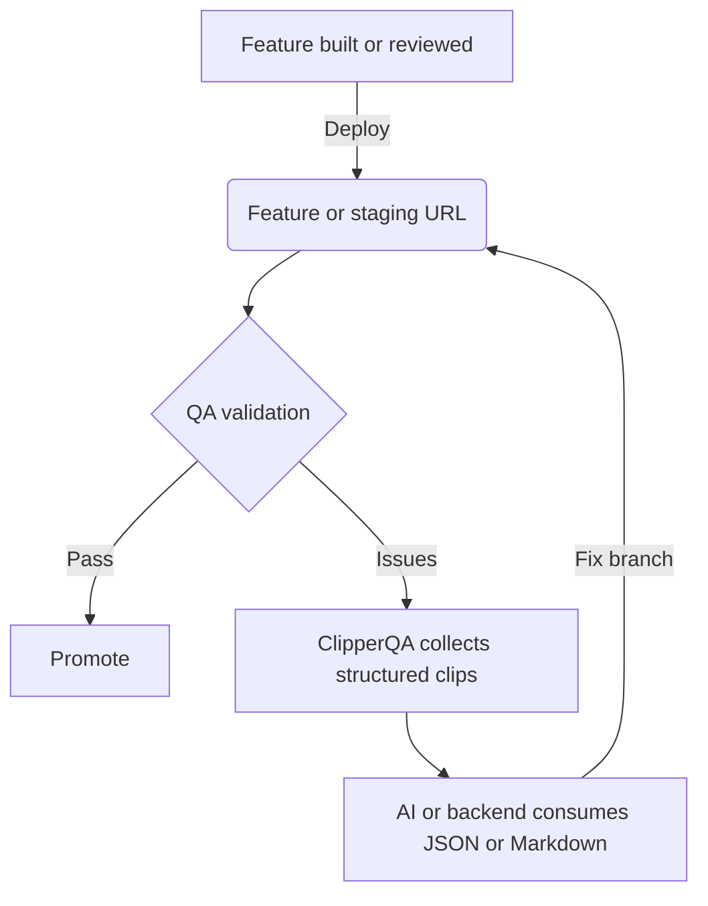

   

Translation: [Читать на русском языке (🇷🇺)](./README.ru.md)

# ClipperQA: A Concept for AI-Driven QA Orchestration

**ClipperQA** is a reference widget and Babel plugin for React apps. It helps QA collect structured bug context (file path, component name, classes, breakpoint, notes) for AI-assisted fixes—without dumping full DOM or video.

### Core capabilities

- **Traceability:** Build-time `data-qa-file` / `data-qa-component` on JSX (when enabled).
- **Context capture:** Element classes and viewport breakpoint at clip time.
- **Batching:** Bugs stored in `localStorage` until send or copy.
- **Delivery options:** In **default** mode, POST JSON to your API URLs from env; in **copyinfo** mode, copy a Jira-friendly Markdown block to the clipboard.

---

## Why ClipperQA?

Many feedback tools optimize for human-to-human handoff (screenshots, session replay). ClipperQA focuses on **compact, structured payloads** so LLMs can map issues to source files with less noise.

---

## Operational lifecycle (concept)

Typical steps:

1. QA enables the widget on a test build and clips elements (e.g. Alt+click or Inspect mode).
2. They describe each clip in the panel.
3. **Default:** **Send to AI** posts `{ bugs, context }` to your endpoint; **Well done** posts `{ done: true, context }` to another. **Copy-info:** **Copy** puts Jira Markdown (including stand / app / branch metadata) on the clipboard.

---

## Technical integration (quick pointer)

Implementation details—**all environment variables**, **Next/Vite/Babel snippets**, **API request bodies**, **CORS**, **file layout**, and **Turbopack notes**—live in one place:

**[plugins/clipper-qa/README.md](./plugins/clipper-qa/README.md)** (authoritative integration guide).

Minimal checklist for this repo:

1. Set `NEXT_PUBLIC_CLIPPER_QA_ENABLED=true` (or `VITE_CLIPPER_QA_ENABLED=true` for Vite) so the Babel plugin runs and the widget can render.
2. Render `<ClipperQA />` in the root layout only when enabled (see [`src/app/layout.tsx`](./src/app/layout.tsx) and `clipperQaIsEnabled()` in the plugin).
3. For **default** mode APIs, set `NEXT_PUBLIC_CLIPPER_QA_SEND_TO_AI_URL` and `NEXT_PUBLIC_CLIPPER_QA_WELL_DONE_URL` as documented in the plugin README.

Dependencies used by the widget: `react`, `react-dom`, `lucide-react`; Babel plugin needs the app’s Babel pipeline (e.g. Next’s `next/babel` or Vite + `@vitejs/plugin-react`).

---

## Safety and compliance

- **No PII by design:** Only structural metadata you clip (paths, classes, your descriptions)—no automatic screen recording.
- **Audit context:** Optional build-time metadata (app name, version, branch) for exports—see `next.config.ts` and plugin README.

---

## Legal and disclaimer

This repository is a **reference implementation** for education and demonstration. It is not a formal open-source product release. The code is a generalized pattern; for commercial use or IP questions, contact the repository owner.

**Designed for precision. Optimized for structured handoff to AI.**
