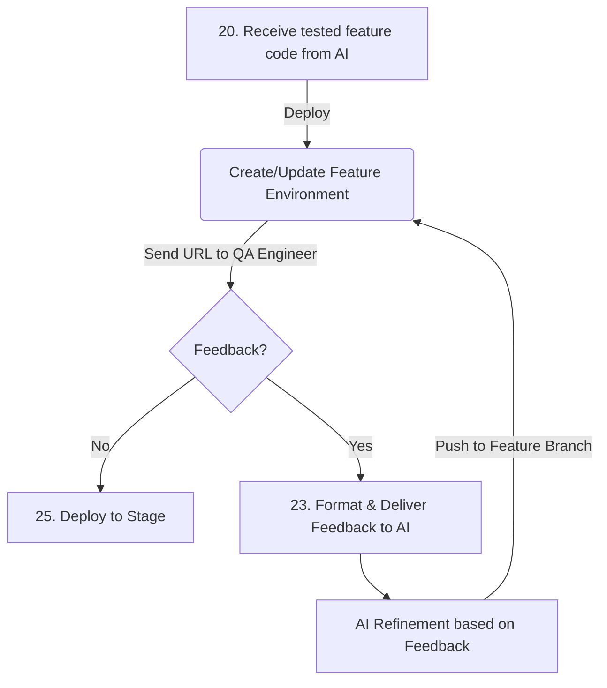

This translation is optimized for the Dutch IT market, which highly values **Clean Code**, **Systematic Automation**, and **Practical Innovation**. The tone is professional, technical, and direct.

-----

# ClipperQA

An intelligent "clipper" for React applications designed to empower QA engineers to capture a series of bugs with full technical context for AI-driven development.

### Core Capabilities:

  * **Component Inspection:** Automatic resolution of file paths via `data-qa-file` attributes.
  * **Context Capture:** Extraction of props from the React Fiber tree and Tailwind CSS classes.
  * **Batching:** LocalStorage-based aggregation of bug reports for unified submission to Replit or GitLab.
  * **Responsive Awareness:** Automatic detection and logging of the active breakpoint (Mobile/Desktop).

**Human-in-the-Loop: Manual testing with AI-ready data delivery.**

## System Architecture

The tool sits at the heart of the "Human-in-the-Loop" feedback cycle, ensuring that AI agents receive structured, actionable data rather than ambiguous prose.



### Environment Workflow

  * Provisioning of dedicated feature branches for manual testing.
  * Automatic deployment of ephemeral environments (Dev Mode).
  * Seamless URL delivery to the QA team.

## The Problem & Strategic Goal

The goal is to provide a tool for manual bug collection and description that bridges the gap between human intuition and machine execution.

### Requirements

  * **User-Centric:** Intuitive and low-friction for QA engineers.
  * **AI-Native:** Structured bug descriptions optimized for Large Language Models (LLMs).
  * **Efficiency:** Reduction in token consumption and CI/CD build cycles.

### Market Context

Most existing feedback tools (e.g., Marker.io, rrweb) are built for human-to-human communication. They often result in "information noise"—unstructured screenshots, video recordings, and massive log dumps. For an AI, this lack of focus leads to context dilution and excessive token costs.

ClipperQA solves this by providing a lightweight, custom integration that "speaks" the language of the codebase.

-----

## Technical Implementation: The Clipper

The script integrates during the build phase and operates on the "Component Inspector" principle.

### Automated Metadata (Data Attributes)

During the frontend build process, the plugin injects the component name and source file path into each element.

**Code Example:**

```html
<div
    data-qa-component="Header"
    data-qa-file="src/components/Header.tsx"
>...</div>
```

When a tester identifies a bug (e.g., via **Alt + Click**), the script traverses the DOM tree to the nearest element containing the required metadata.

### Structured AI Context

ClipperQA generates a precise JSON object for each issue. Example of a batched bug report:

```json
  {
    "id": "11bae0aa-d75b-4d69-bd51-84e22ddfdece",
    "file": "src/components/ProductCard.tsx",
    "component": "ProductCard",
    "classes": "text-lg font-medium text-zinc-700 dark:text-zinc-300",
    "description": "The 'Save' button overflows the container on mobile devices.",
    "breakpoint": "Mobile"
  }
```

The structure captures the exact responsive state and the Tailwind classes of the affected element, allowing the AI to pinpoint the fix immediately.

-----

## Workflow & Lifecycle

### 1\. Batching & Persistence

To optimize token usage, bugs are processed in **sessions**.

  * **LocalStorage:** Data is persisted in LocalStorage to ensure survival across page reloads or redirects.
  * **Cross-Tab Sync:** The widget synchronizes across multiple open tabs using the `storage` event listener.
  * **Visual Feedback:** An overlay "floats" over the application, allowing QA to collect 5-10 bugs per session with optional element highlighting.

### 2\. Delivery & Execution

  * **Submission:** Upon clicking "Send," the widget generates a single GitLab Issue containing the structured JSON payload. LocalStorage is cleared.
  * **AI Trigger:** A GitLab Webhook triggers the AI agent.
  * **Fixing:** The AI processes all bugs in a single pass within the feature branch. This is particularly effective for Tailwind CSS adjustments.
  * **Re-deploy:** GitLab CI automatically updates the feature environment.

-----

## Integration Guide

The widget and Babel plugin are located in the [`plugins/clipper-qa`](https://www.google.com/search?q=./plugins/clipper-qa/) directory.

### Installation

Copy the `plugins/clipper-qa` folder (including `index.js`, `babel-plugin-clipper-qa.js`, and `ClipperQA.tsx`) into your repository.

### Dependencies

| Package | Purpose |
|--------|-------------|
| **`react`**, **`react-dom`** | Core UI for the `ClipperQA.tsx` widget. |
| **`lucide-react`** | UI Icons for the widget panel. |
| **`@babel/core`** | Required for custom Babel transformations. |

### Configuration

#### Option A: Automatic Instrumentation (Babel)

In **development** mode, the plugin automatically injects `data-qa-*` attributes and mounts the `<ClipperQA />` widget into entry points (`App.tsx` or `layout.tsx`).

**Next.js (`.babelrc`):**

```json
{
  "presets": ["next/babel"],
  "plugins": ["./plugins/clipper-qa/index.js"]
}
```

**Vite (`vite.config.ts`):**

```typescript
import path from 'node:path'
import { defineConfig } from 'vite'
import react from '@vitejs/plugin-react'

export default defineConfig({
  plugins: [
    react({
      babel: {
        plugins: [path.resolve(__dirname, 'plugins/clipper-qa/index.js')],
      },
    }),
  ],
})
```

#### Option B: Manual Implementation

If you prefer not to use the Babel plugin for widget injection, import the component manually into your root layout:

```tsx
import { ClipperQA } from '../plugins/clipper-qa/ClipperQA';

export default function RootLayout({ children }) {
  return (
    <html>
      <body>
        {children}
        {process.env.NODE_ENV === 'development' && <ClipperQA />}
      </body>
    </html>
  );
}
```

*Note: Without the plugin, `data-qa-*` attributes must be added to your JSX components manually.*