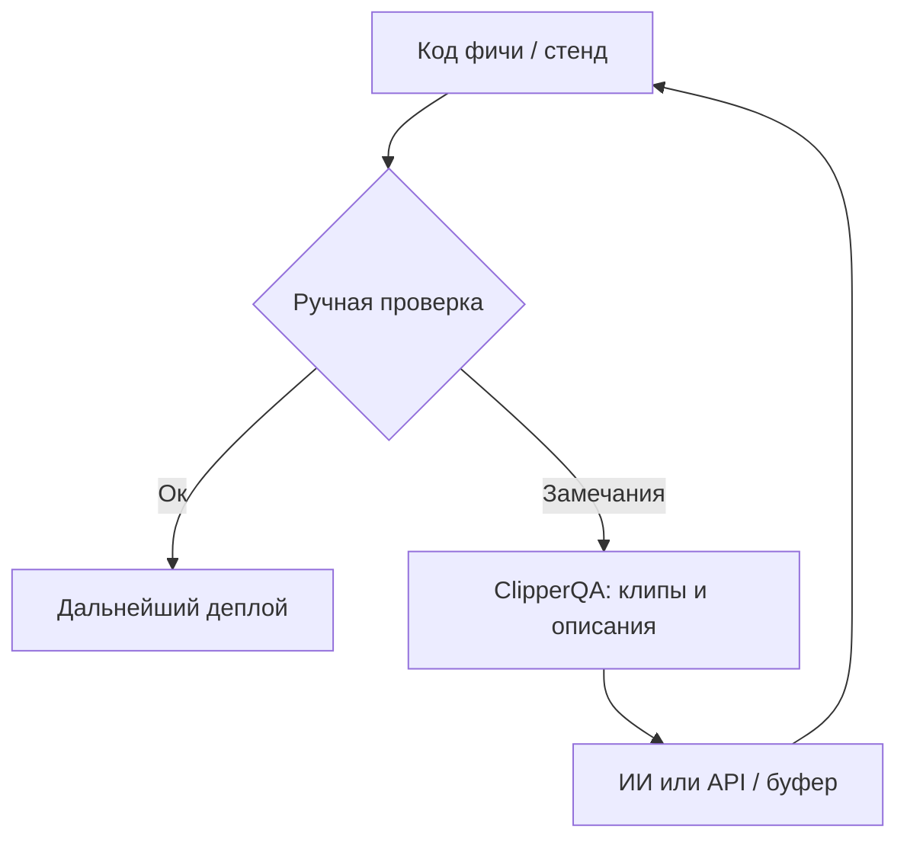
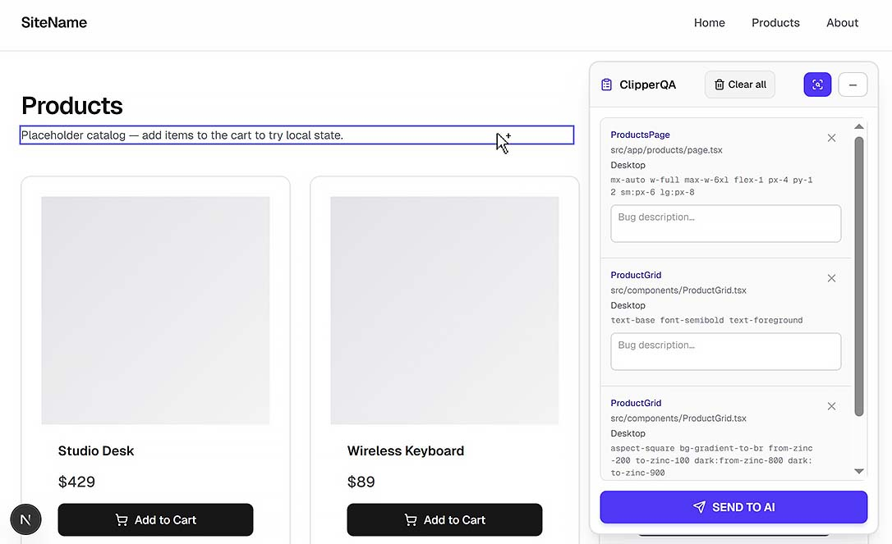

# ClipperQA

Реализация концепции «клипера» для React: тестировщик собирает серию багов с техническим контекстом (файл, компонент, классы, брейкпоинт, текст) для передачи в ИИ или в трекер.

Перевод на английский: [README.md](./README.md)

### Основные возможности

- Разметка **`data-qa-*`** на этапе сборки (при включённом флаге), не в исходниках.
- Клип элемента (Alt+клик / режим Inspect), описание в панели.
- Пакетное накопление в **LocalStorage**.
- Режим **`default`**: POST на ваши URL (**отправка в ИИ** и **Well done**). Режим **`copyinfo`**: копирование Markdown для Jira.

---

## Место в процессе

---

## Как это работает (кратко)

1. Включён флаг окружения (`NEXT_PUBLIC_CLIPPER_QA_ENABLED` или пара для Vite — см. плагиновый README).
2. В корне приложения рендерится `<ClipperQA />` **только при том же флаге**, что и для Babel.
3. Тестировщик добавляет клипы, заполняет описания, затем отправляет или копирует — в зависимости от режима.

Подробности по JSON API, переменным, Next/Vite, Turbopack и структуре файлов:

**[plugins/clipper-qa/README.md](./plugins/clipper-qa/README.md)** — единая техническая справка.

---

## Подключение в другой проект

1. Скопируйте каталог [`plugins/clipper-qa`](./plugins/clipper-qa/) в свой репозиторий.
2. Подключите Babel-плагин (`index.js`) и задайте переменные окружения — пошагово в [plugins/clipper-qa/README.md](./plugins/clipper-qa/README.md).
3. Зависимости виджета: **`react`**, **`react-dom`**, **`lucide-react`**. Для сборки с кастомным Babel — **`@babel/core`** (в Next обычно уже есть через `next`).

Удобно сделать обёртку `src/components/clipper-qa/ClipperQA.tsx` с реэкспортом из `plugins/clipper-qa/ClipperQA` для алиасов `@/`.

Примеры `.babelrc` / `vite.config.ts` и полная таблица env **не дублируются здесь** — см. плагиновый README.

---

## Важно

Плагин **не** привязан к `NODE_ENV === "development"`: разметка и автодобавление виджета зависят от явного флага включения (см. документацию плагина).
