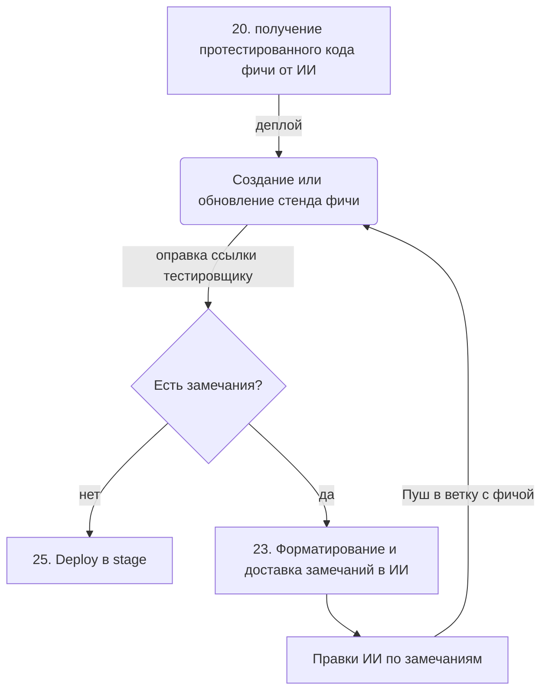

# ClipperQA

Вариант реализации концепции интеллектуального "клипера" для React-приложений, который позволяет тестировщикам собирать серию багов с полным техническим контекстом для ИИ-разработки.

### Основные возможности:

- **Component Inspection:** Автоматическое определение пути к файлу (`data-qa-file`).
- **Context Capture:** Захват пропсов из React Fiber и Tailwind-классов.
- **Batching:** Сбор серии багов в LocalStorage для единой отправки в Replit/GitLab.
- **Responsive Aware:** Фиксация активного брейкпоинта (Mobile/Desktop).

Ручное тестирование с отправкой данных в ИИ

## Место в общей схеме



### Окружение

- создание отдельной ветки для ручного тестирования фичи
- создание отдельного стенда для этой ветки (dev mode)
- отправка ссылки тестировщику

## Задача

Нужен иструмент для ручного сбора и описания багов

### Условия

- удобный и понятный для тестировщика
- структурированное описание багов для ИИ
- экономия (токенов и времени сборки)

### Поиск

Все готовые инструменты обратной связи ориентированы на человека, а не на ИИ. Одни направлены либо на упрощении интеграции с gitlab issue (Marker.io), другие - на сбор дополнительной инфы: скриншоты/видео, логи консоли и сетевые запросы, данные об окружении (rrweb).

Для ИИ это означает отсутствие структуры, информационный шум (потеря фокуса) и лишнюю трату токенов.

Самый экономичный вариант - написать маленький кастомный скрипт.

### Клиппер

Скрипт интегрируется на этапе сборки.
Работает по принципу «Инспектора компонентов».

data-атрибуты - при сборке фронтенда в каждый компонент добавляется его название и путь к файлу.

Пример в коде:

```
<div
    data-qa-component="Header"
    data-qa-file="src/components/Header.tsx"
>...</div>
```

Когда тестировщик кликает на баг (например с Alt), скрипт поднимается вверх по дереву до ближайшего элемента с нужным data-атрибутом.

Клиппер собирает структурированно инфо для ИИ. Пример одного объекта из серии:

```JSON
  {
    "id": "11bae0aa-d75b-4d69-bd51-84e22ddfdece",
    "file": "src/components/ProductCard.tsx",
    "component": "ProductCard",
    "classes": "text-lg font-medium text-zinc-700 dark:text-zinc-300",
    "description": "Кнопка 'Сохранить' выходит за границы контейнера на мобильных устройствах",
    "breakpoint": "Desktop"
  }
```

В структуре указан тип экрана (декстоп/мобилка) и список классов проблемного элемента.

### Сбор

Чтобы экономить токены и время сборки, лучше обрабатывать баги пакетно, сессиями. Сессия - это набор багов.

Промежуточные данные сохраняются в LocalStorage. Это гарантирует выживаемость данных при падении страницы или долгих редиректах. Есть кнопка очистки.

Виджет синхронизируется по вкладкам, если тестировщик их несколько (через window.addEventListener('storage', ...)).

Виджет клипера визуально «висит» над сайтом и копит данные, пока QA перемещается по разделам. Можно сделать подсветку выделяемого элемента.


### Отправка

Финальный цикл выглядит так:

Batching: Тестировщик проходит по сайту, кликает на компоненты и собирает 5-10 багов в корзину виджета.

Delivery: Нажимает «Отправить», и виджет формирует один GitLab Issue с JSON-структурой внутри. LocalStorage очищается.

AI Trigger: GitLab Webhook активирует ИИ-агента.

Fixing: ИИ за один проход правит все файлы в feature-ветке. Особенно удобно это с Tailwind.

Re-deploy: GitLab CI обновляет контейнер в облаке.

## Подключение виджета в другой проект

Виджет и Babel-плагин лежат в каталоге [`plugins/clipper-qa`](./plugins/clipper-qa/). Подробности по поведению плагина и примерам конфигов — в [`plugins/clipper-qa/README.md`](./plugins/clipper-qa/README.md).

### Что скопировать

Скопируйте в целевой репозиторий всю папку `plugins/clipper-qa` (как минимум файлы `index.js`, `babel-plugin-clipper-qa.js`, `ClipperQA.tsx`). Путь к плагину в конфиге Babel/Vite должен совпадать с фактическим расположением (например `./plugins/clipper-qa/index.js` из корня проекта).

### Зависимости npm

| Пакет                        | Назначение                                                                                                                                 |
| ---------------------------- | ------------------------------------------------------------------------------------------------------------------------------------------ |
| **`react`**, **`react-dom`** | Виджет — клиентский React-компонент (`ClipperQA.tsx`).                                                                                     |
| **`lucide-react`**           | Иконки в панели виджета.                                                                                                                   |
| **`@babel/core`**            | Нужен для сборки с кастомным Babel (например отдельный скрипт или явная настройка); в Next.js обычно уже тянется транзитивно через `next`. |

Дополнительно по стеку:

- **Next.js** — в `devDependencies` достаточно `next`; в корне проекта добавьте [`.babelrc`](./.babelrc) с пресетом `next/babel` и плагином `./plugins/clipper-qa/index.js` (см. ниже).
- **Vite + React** — `@vitejs/plugin-react` и подключение того же `index.js` в `babel.plugins` у `react()` (пример в плагиновом README).

Установка минимального набора для «голого» React-проекта с Babel:

```bash
npm install react react-dom lucide-react
npm install --save-dev @babel/core
```

(Для Next/Vite добавьте к этому свои зависимости сборщика.)

### Вариант A: автоматическая разметка и вставка виджета (Babel)

В **development** плагин добавляет на JSX атрибуты `data-qa-file` / `data-qa-component` и может сам вставить `<ClipperQA />` в распознаваемые entry-файлы (`src/app/layout.tsx`, `app/layout.tsx`, `src/App.tsx`). В **production** (`NODE_ENV !== "development"`) код не меняется.

**Next.js** — `.babelrc` в корне целевого проекта:

```json
{
  "presets": ["next/babel"],
  "plugins": ["./plugins/clipper-qa/index.js"]
}
```

**Next.js 16 + `next dev` (Turbopack):** Turbopack может вести себя иначе, чем Webpack, по отношению к `.babelrc`. Надёжные варианты: запуск `next dev --webpack` или ручное подключение `<ClipperQA />` в корневом layout (вариант B).

**Vite** — фрагмент `vite.config.ts` (полный пример — в [`plugins/clipper-qa/README.md`](./plugins/clipper-qa/README.md)):

```typescript
import path from 'node:path'
import { defineConfig } from 'vite'
import react from '@vitejs/plugin-react'

export default defineConfig({
  plugins: [
    react({
      babel: {
        plugins: [path.resolve(__dirname, 'plugins/clipper-qa/index.js')],
      },
    }),
  ],
})
```

Используйте `path.resolve`, чтобы путь к плагину одинаково работал на Windows и Unix.

### Вариант B: только виджет вручную

Если Babel-плагин не подключаете, импортируйте компонент в корневой layout (или аналог) и отрендерьте его один раз на клиенте, например в конце `<body>`:

```tsx
import { ClipperQA } from '../plugins/clipper-qa/ClipperQA'
// или через алиас / обёртку в `src/components/clipper-qa/ClipperQA.tsx`

// …
;<body>
  {children}
  <ClipperQA />
</body>
```

Без плагина атрибуты `data-qa-*` в JSX **не** появятся автоматически — их нужно добавлять вручную или подключить плагин.

### Рекомендация по импорту

Удобно завести в приложении тонкую обёртку `src/components/clipper-qa/ClipperQA.tsx`, реэкспортирующую `plugins/clipper-qa/ClipperQA.tsx`, и импортировать виджет оттуда — так проще с алиасами (`@/…`) и единой точкой подключения.

### Правовая информация и отказ от ответственности

Статус концепции: Этот репозиторий представляет собой эталонную реализацию концепции цикла обратной связи между QA-специалистами и ИИ. Он предназначен для образовательных и демонстрационных целей, чтобы показать, как структурированная телеметрия может оптимизировать циклы исправления ошибок, управляемые ИИ.

Уведомление о правах собственности: Этот проект был разработан в процессе профессионального развития. Предоставленный здесь код представляет собой обобщенную, чистую реализацию шаблона.

Лицензия: Эта эталонная реализация предоставляется «как есть» без официальной лицензии с открытым исходным кодом. По вопросам коммерческого использования, интеграции или интеллектуальной собственности обращайтесь к владельцу репозитория.
